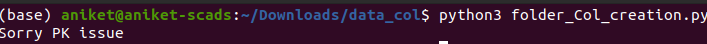
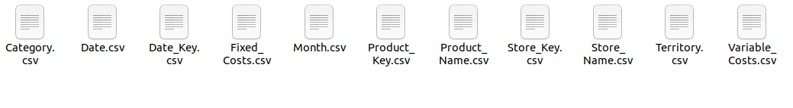
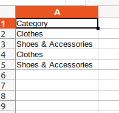
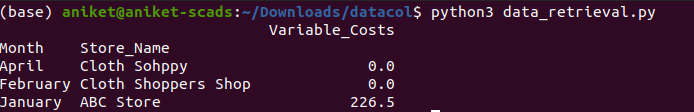

# Data Modelling Course (CS 605)

**Project Objective**- To store relational tables in star schema format from row-oriented format to **column oriented** format for memory-efficient computing.

## Star Schema
It contains a central **fact table** and surrounding **dimensional tables**. The dimensional tables have Primary Keys which are related to the Foreign Keys in Fact Table maintaining **Integrity Constraint**. Fact tables contains numerical/measurable information and dimension tables contains descriptive attributes of the measures in fact table.

We aim to store star schema information in **column-oriented** method rather than the usual row-oriented way. It enables more memory-efficient and faster aggregation or selection operation on data.

## Column-Store and Aggregation Query Pipeline
To run the pipeline it's simple.
1. The star schema information is stored in **extra3.xml** file.
2. Accordingly the code **folder_Col_creation.py** stores the data in columnar format i.e, related information is close to each other, or in simple words rows a column are stored next to each other. It performs the following operations:
   
                          a. First check if the column-store already exists for the given schema.
   
                          b. Secondly checks for any PK issue/violation in the dimensions table.

                          c. Thirdly checks for any FK issue in the Fact Table side.
                          
                          d. Lastly it checks whether all the columns in tables adheres to their correct datatype. Eg: numerical column cannot contain *Hello*.
                          
                          e. If everything is okay then it stores the star-schema data in columnar format.
                          
                          f. Otherwise throws the error accordingly like- *Foreign Key Constraint Issue*.
3. After we create our columnar storage of data we can provide aggregate queries like sum, average etc. on numerical column grouped by any of the descriptive columns using code and print and save the results using code file **data_retrieval.py**.

## Snpshots

